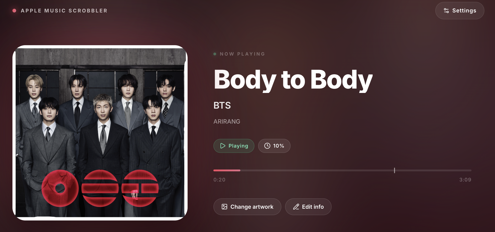

# Apple Music Scrobbler

[English](README.md) · **ภาษาไทย**


Menu bar app สำหรับ macOS ที่ติดตามเพลงที่กำลังเล่นใน **Apple Music**, ส่งข้อมูลไป **Last.fm** (now playing + scrobble), และยิง **Webhook** ให้ระบบอื่น ๆ



---

## ✨ ฟีเจอร์

- 🎵 **Track ที่กำลังเล่นแบบ real-time** ผ่าน AppleScript (ไม่ต้องลง extension เพิ่ม)
- 📡 **Last.fm scrobble** — ส่ง now playing ทันที, scrobble เมื่อฟังครบตาม threshold
- 🔁 **ตรวจจับ replay / pause / resume** — ไม่ scrobble ซ้ำถ้า pause แล้วเล่นต่อ (ยกเว้นกดย้อนต้นจริง ๆ)
- 🪝 **Webhook** — POST JSON (รองรับ payload format เดียวกับ Music-Scrobbler) พร้อม heartbeat
- 🖼️ **Artwork + animated cover** ดึงจาก iTunes API + hi-res fallback
- 🛎️ **Native notification** พร้อม artwork
- ✏️ **Edit history** — แก้ชื่อเพลง/ศิลปิน/อัลบั้มที่ Apple Music ให้ข้อมูลผิด ระบบจะ apply ก่อน scrobble ทุกครั้ง
- 📊 **Play history** — เก็บใน SQLite, export/import JSON หรือ CSV
- 🍔 **Menu bar** ปรับแต่งข้อมูลที่แสดงได้ (icon / สถานะ / ชื่อเพลง / ศิลปิน / ความยาว)
- 🌍 **รองรับภาษา** ไทย / English

---

## 🚀 ติดตั้ง

### ตัวเลือก 1 — ใช้งานเร็ว (โหมด menu bar app)

```bash
git clone <repo-url> apple-music-scrobbler
cd apple-music-scrobbler
pip3 install -r requirements.txt
python3 app.py
```

ไอคอน ♪ จะโผล่บน menu bar → เปิดเพลงใน Apple Music ได้เลย

### ตัวเลือก 2 — เซิร์ฟเวอร์เฉย ๆ (ไม่มี menu bar)

```bash
python3 server.py
# เปิด http://localhost:8765
```

### ตัวเลือก 3 — build .app bundle

```bash
cp .env.example .env
# กรอก LASTFM_API_KEY / LASTFM_API_SECRET
# สมัครได้ที่ https://www.last.fm/api/account/create

./build.sh
open "dist/Apple Music Scrobbler.app"
```

---

## ⚙️ ตั้งค่า

คลิกไอคอน ♪ บน menu bar → **ตั้งค่า** (หรือเปิด `http://localhost:8765/settings.html`)

| หมวด | ทำอะไรได้บ้าง |
|---|---|
| **Last.fm** | เชื่อมบัญชี, เปิด/ปิด scrobble |
| **Webhook** | ใส่ URL, heartbeat interval, ดู payload ตัวอย่าง, ทดสอบส่ง |
| **Scrobble** | ปรับ % ของเพลงที่ต้องฟังก่อน scrobble (default 50%), min duration |
| **Menu Bar** | เลือกว่าจะแสดงอะไรบน menu bar (icon, สถานะ ▶/⏸, ชื่อเพลง, ศิลปิน, ความยาวสูงสุด) |
| **Notifications** | เปิด/ปิด, เลือกแจ้งเตือนตอน play ใหม่ หรือตอน scrobble สำเร็จ |
| **Play History** | ดู/export/import ประวัติการฟัง (JSON/CSV) |
| **Edit History** | แก้ชื่อเพลง/ศิลปิน/อัลบั้มที่ผิดไว้ล่วงหน้า — apply ก่อน scrobble ทุกครั้ง |

---

## 🪝 Webhook Payload

POST JSON เมื่อเกิด event (`play`, `replay`, `resume`, `pause`, `scrobble`, `stopped`) — โดยใช้ map ต่อไปนี้:

| Internal event | eventName ที่ส่งออก |
|---|---|
| play / replay / resume | `nowplaying` |
| pause / stopped | `paused` |
| scrobble | `scrobble` |

ตัวอย่าง payload:

```json
{
  "eventName": "scrobble",
  "time": 1713600000000,
  "data": {
    "song": {
      "processed": { "artist": "...", "track": "...", "album": "...", "duration": 201 },
      "parsed":    { "artist": "...", "track": "...", "duration": 201, "currentTime": 120, "isPlaying": true },
      "flags":     { "isValid": true },
      "metadata": {
        "label": "Apple Music Scrobbler",
        "trackArtUrl": "https://...",
        "animationUrl": "",
        "primaryMediaUrl": "https://...",
        "primaryMediaType": "image"
      },
      "connector": { "label": "Apple Music" }
    }
  }
}
```

---

## 🧠 Scrobble Logic

- **First play** — เริ่ม track ใหม่ → ส่ง `now playing` ทันที
- **Scrobble trigger** — ฟังครบ 50% (ปรับได้) **หรือ** 240 วินาที **และ** ฟังมาแล้วอย่างน้อย 30 วินาที → ส่ง scrobble
- **Pause → Play (เพลงเดิม)** — ไม่ scrobble ซ้ำ
- **Replay** (กดย้อนไปต้น) — scrobble ใหม่ได้
- **Stop → Play (เพลงเดิม)** — นับเป็นรอบใหม่ scrobble ได้
- **เพลงสั้นกว่า 30s** — ข้าม ไม่ scrobble (ตามกติกา Last.fm)

---

## 📂 โครงสร้างไฟล์

```
apple-music/
├── app.py              # Menu bar app (rumps + pyobjc)
├── server.py           # HTTP server + tracker + webhook + Last.fm
├── web/                # ไฟล์ Static web (UI)
│   ├── index.html      # หน้าหลัก (now playing + history)
│   ├── settings.html   # หน้าตั้งค่า
│   └── i18n.js         # Dictionary ไทย/อังกฤษ
├── scripts/            # AppleScripts สำหรับดึงข้อมูลเพลง
│   └── tracker.applescript # Legacy — เวอร์ชัน AppleScript ล้วน ๆ
├── setup.py            # py2app build config
├── build.sh            # Build .app bundle
├── start.sh            # เริ่มแบบ dev (python3 server.py)
└── requirements.txt
```

Runtime files (เก็บใน `~/Library/Application Support/AppleMusicScrobbler/` เมื่อเป็น .app bundle):

- `settings.json` — config
- `history.db` — play history (SQLite)
- `now_playing.json` — snapshot ปัจจุบัน
- `edit_history.json` — ข้อมูลเพลงที่แก้ไว้

---

## 🛠️ Development

```bash
# dev build (symlinked — แก้โค้ดแล้วไม่ต้อง build ใหม่)
python3 setup.py py2app -A

# clean + release build
./build.sh
```

Dependency หลัก:

- **rumps** — menu bar app framework
- **pyobjc** — NSUserNotification + native APIs
- **py2app** — สร้าง .app bundle

---

## 📋 Requirements

- macOS 11+
- Python 3.9+
- Apple Music (มากับ macOS)
- บัญชี Last.fm (ถ้าต้องการ scrobble) + API key

---

## 🔒 Privacy

- ข้อมูลเพลงทั้งหมดเก็บใน local (SQLite + JSON)
- ไม่มี telemetry / analytics
- Last.fm credentials เก็บใน `settings.json` (local) หรือ bundled ตอน build
- Webhook URL เป็นของผู้ใช้เอง
